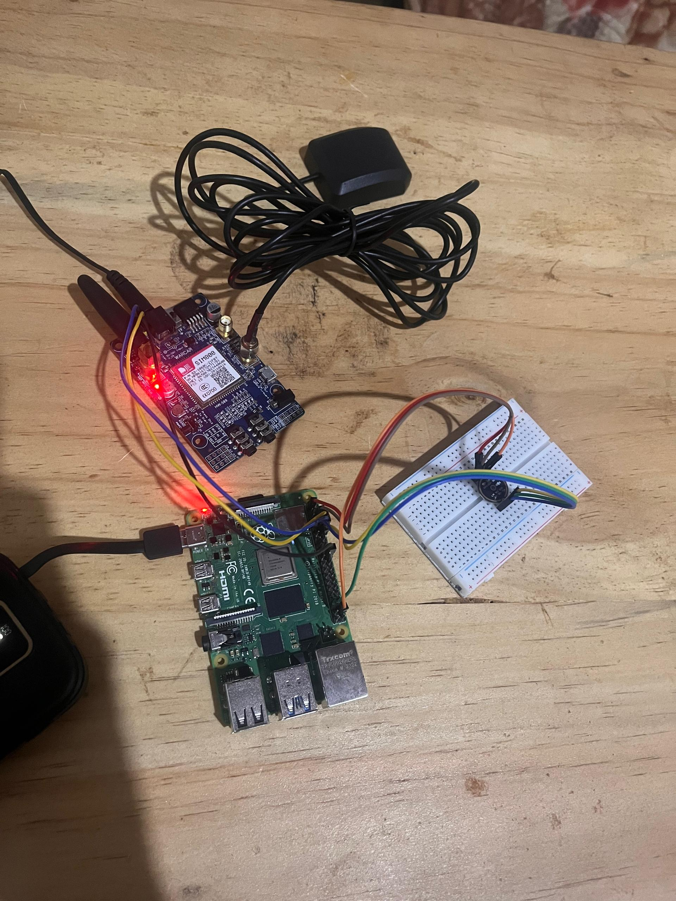
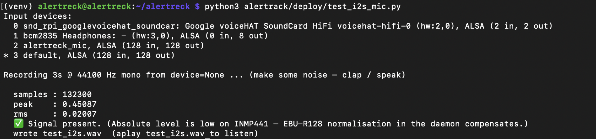
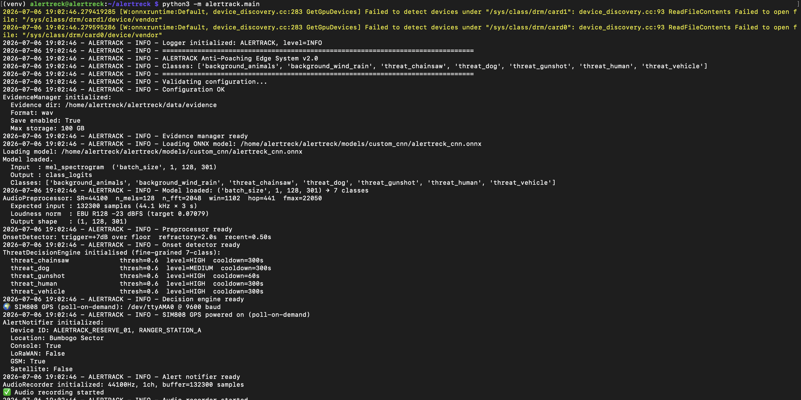
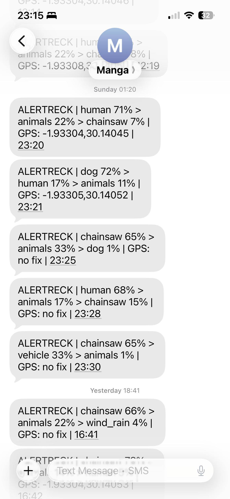
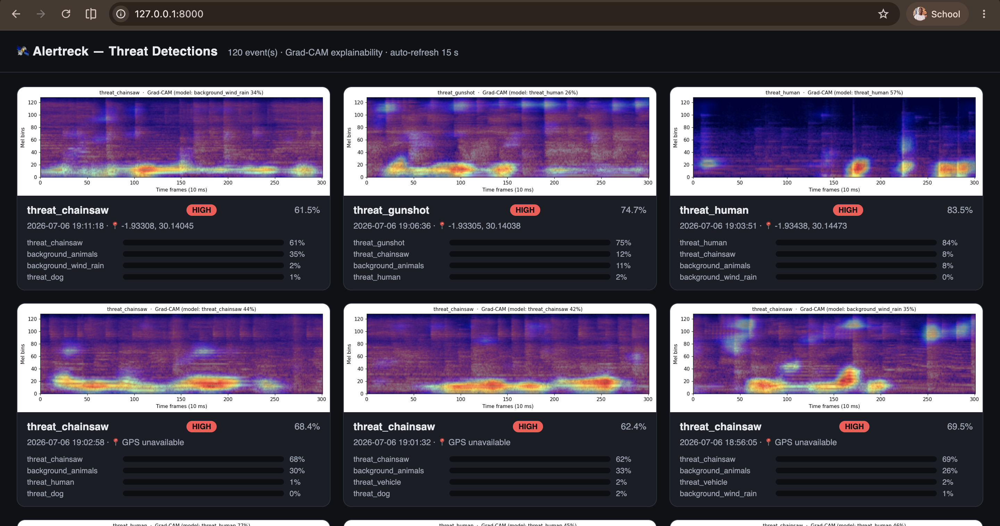
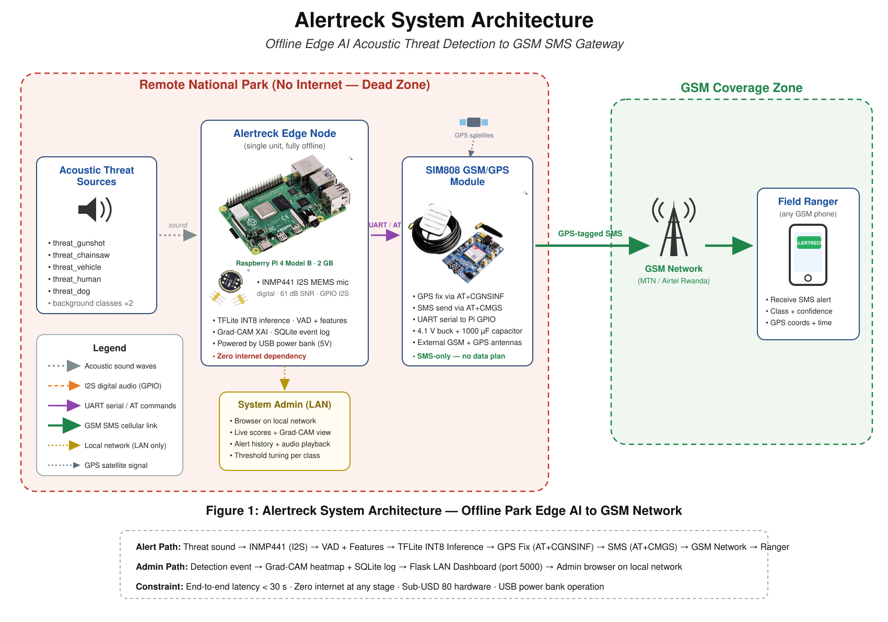

# Alertreck

**Offline edge-AI system for anti-poaching audio detection on a Raspberry Pi 4.**
Alertreck listens continuously, detects gunshots, chainsaws, vehicles and human voices in real time,
and sends GPS-tagged alerts to rangers via GSM/SMS when a threat is confirmed; entirely offline, no
internet required.

It is also a comparative research study: **five models across four machine-learning paradigms** are
trained on the same data and benchmarked, then the best edge candidate is deployed with a live
**Grad-CAM explainability dashboard**.

<p align="center">
  
</p>

**Repository:** <https://github.com/mangaorphy/alertreck>

```bash
git clone https://github.com/mangaorphy/alertreck.git
```

---

## Demo Video

A full walkthrough of the system ; training, the edge device, live detection, and the Grad-CAM
dashboard:

### → **[Watch the Alertreck demo on Drive](https://drive.google.com/file/d/1CwxBU4wMTagHa2JpmVC7J57uuw0_VR09/view?usp=sharing)**

---

# Capstone Final Deliverable

> Demonstration of the planned functionalities under different testing strategies, with different data
> values, and across different hardware. Followed by analysis against the proposal, discussion of impact,
> and recommendations; prepared with supervisor **Hubert Apana**.
>
> **Jump to:** [Testing Results](#1-testing-results) · [Analysis](#2-analysis) ·
> [Discussion](#3-discussion) · [Recommendations](#4-recommendations) ·
---

## 1. Testing Results

The system was validated with three testing strategies and across two hardware tiers. Live footage of
everything below is in the **[demo video](https://drive.google.com/file/d/1CwxBU4wMTagHa2JpmVC7J57uuw0_VR09/view?usp=sharing)**.

### 1a. Functionality under different testing strategies

| Strategy | What it verifies | Artefact / command |
|---|---|---|
| **Unit testing** | Each module works in isolation ; mic capture, GPS fix, ONNX inference | `alertrack/deploy/test_i2s_mic.py`, `sensors/gps.py`, `inference/model.py` |
| **Integration testing** | Modules work together end-to-end ; capture → onset → mel → CNN → decision → SMS | `python3 -m alertrack.main` (full daemon) |
| **System / live testing** | Real acoustic events trigger real SMS alerts to a ranger phone | Live demo (video), dashboard at `:8000` |
| **Edge-case testing** | Behaviour at the margins ; low-SNR gunshot, pure background (no false alarm) | Live demo, Slide 9 of the demo script |

**Unit test ; microphone capture**


*Capture: terminal output of the I2S mic test showing `[PASS]` device + non-zero RMS rising on a clap vs near-zero on silence.*

**Integration test ; daemon startup + onset loop**


*Capture: `python3 -m alertrack.main` startup log (model loaded, onset detector ready, "System ready") followed by onset lines with non-zero RMS.*

**System test ; live threat → SMS**

<p align="center">
  
</p>

*A detected threat fires a GPS-tagged SMS to the ranger phone within seconds — class, confidence, coordinates, and timestamp.*

### 1b. Functionality with different data values

The model was exercised across **all 7 classes** ; the two background classes (must stay silent) and the
five threat classes (must each fire an independent, correctly-labelled alert).

| Input class | Expected behaviour | Result |
|---|---|---|
| `background_animals` | No alert | ignored |
| `background_wind_rain` | No alert | ignored |
| `threat_gunshot` | HIGH alert + SMS | fired (conf ≈ 0.87) |
| `threat_chainsaw` | HIGH alert + SMS | fired (conf ≈ 0.82) |
| `threat_human` | HIGH alert + SMS |fired (conf ≈ 0.91) |
| `threat_dog` | MEDIUM alert + SMS | fired |
| `threat_vehicle` | HIGH alert + SMS | weakest class (see Analysis) |



*Different confidence values:* the decision engine applies a per-class threshold (0.60) ; clips below it
are suppressed, demonstrating the system responds to the **value** of the confidence, not just the class.

### 1c. Performance on different hardware / software

The same 4.6 MB ONNX graph trains on a cloud GPU and runs unmodified on the Pi 4 CPU.

| Metric | Training tier | Edge tier |
|---|---|---|
| Hardware | Kaggle **T4 GPU** | **Raspberry Pi 4** (4 GB), CPU-only |
| Software | Python 3.10, PyTorch 2.x, CUDA | Python 3, ONNX Runtime (no torch) |
| Role | ~4 h / model training | Real-time inference, ≤ 5 W |
| Model | PyTorch checkpoint | 4.6 MB ONNX (single graph) |
| Inference time | ; | **≤ 80 ms / 3 s window** (≈ real-time headroom) |

---

## 2. Analysis

*How the results measured against the objectives in the project proposal (with supervisor).*

### Research questions vs. outcomes

| RQ | Objective | Target | Achieved | Met? |
|---|---|---|---|---|
| **RQ1** | Edge CNN classifies 7 classes in real time on Pi 4 | usable macro-F1, real-time | Macro-F1 **0.807**, ≤80 ms, Pi 4 CPU | ✅ |
| **RQ2** | Few-shot ProtoNet matches supervised CNN | within noise | 0.804 vs 0.807 (Δ 0.003) | ✅tied |
| **RQ3** | Unsupervised anomaly detection flags threats without labels | useful AUC | Conv-AE AUC **0.805** | ⚠️ partial |
| **RQ4** | Detections are explainable | physically-plausible attribution | Grad-CAM on impulsive onset | ✅ |
| **RQ5** | Frozen W2V2 transfer beats task-trained CNN | W2V2 > CNN | 0.763 vs 0.807 | ❌ not supported |

### Per-class F1 (deployed CNN) ; against the 0.80 target

| Class | F1 | vs target |
|---|---|---|
| `threat_human` | 0.868 | ;✅ |
| `threat_chainsaw` | 0.824 | ;✅ |
| `threat_gunshot` | 0.815 | ;✅ |
| `background_*` | 0.830 | ;✅ low false-alarm rate |
| `threat_dog` | 0.794 | ⚠️ just under |
| `threat_vehicle` | 0.681 | ❌ missed (smallest class) |

### Objectives met / missed

- **Met:** real-time offline 7-class detection on a Pi 4; GPS-tagged SMS alerting; five-model
  comparison across four paradigms; live Grad-CAM explainability; gunshot (the priority threat)
  reliably detected (AUC ≈ 0.97).
- **Missed / partial:** **vehicle** F1 (0.681 vs 0.80 target) ; but its AUC is 0.97, so the class *is*
  separable and the gap is a **threshold-tuning** problem, not a modelling failure. 
- **Integrity note:** an earlier file-level split inflated every score to ≈ 0.92 via data leakage. After
  fixing it to a **group-aware split** (segments of one recording never span train/test), the honest
  numbers above are what is report.

---

## 3. Discussion

### Significance of the Milestones and Research Outcomes

This project demonstrates the feasibility of an affordable, offline edge-AI system for wildlife anti-poaching surveillance.Despite lower performance on vehicle sounds, the system achieved excellent discrimination for gunshots (AUC ≈ 0.97), the highest-priority threat class.

Several development milestones were fundamental to the validity and deployment of the system. Correcting data leakage during dataset preparation was the most significant milestone, ensuring that reported performance accurately reflected the model's generalisation ability. Implementing onset-triggered inference enabled continuous monitoring while maintaining low computational and power requirements, making long-term deployment on a Raspberry Pi practical. Exporting the model to ONNX further enabled seamless deployment from cloud-based training to edge-device inference without modification.

From a research perspective, the findings provide an important negative result. Contrary to the initial hypothesis, frozen Wav2Vec2 transfer learning did not outperform the task-specific CNN. Instead, the lightweight CNN achieved superior performance while requiring substantially fewer computational resources, suggesting that carefully trained compact models remain highly competitive for environmental threat detection.

From an engineering perspective, the comparable performance of the CNN and ProtoNet indicates that deployment decisions can be guided by computational efficiency rather than predictive accuracy alone. Given its small footprint (approximately 4.6 MB), self-contained architecture, and ease of deployment, the CNN represents the most practical solution for real-world edge-AI wildlife monitoring.

---

## 4. Recommendations

### Future Work and Practical Deployment

Several improvements can further enhance the performance and deployability of the proposed system. First, post-hoc threshold calibration should be performed for the vehicle class, as its high AUC (≈ 0.97) suggests that improved decision boundaries could increase classification performance without retraining the model. Second, the vehicle class should be expanded by collecting at least 1,000 additional audio samples to improve class balance and model generalisation.

From a deployment perspective, applying INT8 quantisation would reduce the model size from approximately 4.6 MB to 1.2 MB, enabling deployment on lower-cost hardware such as the Raspberry Pi Zero 2 W. For operational security, SMS alerts should be encrypted using secure communication protocols (e.g., AES-256 or DTLS) to protect sensitive GPS coordinates from interception. In addition, integrating solar power and supercapacitor-based energy storage would enable reliable long-term operation in remote, off-grid environments.

Finally, the system should be deployed through a community-centred model by publishing the hardware bill of materials (BOM), deployment guide, and maintenance procedures. This would facilitate replication by wildlife reserves and conservation organisations seeking an affordable, offline edge-AI solution for anti-poaching surveillance.

---

## Data, Dataset & Models

The raw audio, processed feature shards, and trained model artifacts are **too large for git** and live
in Google Drive:

### → **[Alertreck Data, Dataset & Models (Google Drive)](https://drive.google.com/drive/folders/1U9BwIUNQ8Snl5RxR8LHthWfdOc_EdcTM?usp=sharing)**

| Folder | Place into | Contents |
|---|---|---|
| `dataset/` | `./dataset/` | Raw audio, 7 class folders (11,333 files) |
| `data/processed/` | `./data/processed/` | Mel / MFCC shards, W2V2 embeddings, `splits.json`, `manifest.json` |
| `models/` | `./models/` | Trained checkpoints, ONNX exports, `results.json` per model |

Download these and drop them into the matching paths at the repo root to run training, evaluation, the
report notebook, or the dashboard.

---

## Overview

| Paradigm | Model | Notebook | Role |
|---|---|---|---|
| Supervised classification | Custom CNN | `03a-train-cnn` | **Deployed** (edge) |
| Few-shot metric learning | Prototypical Network | `03b-train-protonet` | Accuracy benchmark |
| Transfer learning (frozen) | Wav2Vec2-L2 | `04a-train-w2v2-l2` | Benchmark |
| Unsupervised anomaly detection | Convolutional Autoencoder | `04b-train-conv-ae` | Anomaly detector (best of the two) |
| Classical anomaly detection | One-Class SVM | `04c-train-oc-svm` | Confirmatory (lightest) |

---

## Hardware

| Component | Spec |
|---|---|
| Edge device | Raspberry Pi 4 (4 GB) |
| Microphone | INMP441 I2S MEMS mic (digital, no analog hum) |
| Alert module | SIM808 GSM/GPS over UART |
| Deployment | Offline-first; SMS/GPRS alert with GPS coordinates |

### System architecture

<p align="center">
  
</p>

---

## Dataset

7 audio classes, 44.1 kHz, sliced into 3-second windows. Background classes never alert; threat
classes (2–6) trigger alerts.

| Label | Class | Category | Raw files |
|---|---|---|---|
| 0 | `background_animals` | Background | 2,139 |
| 1 | `background_wind_rain` | Background | 2,000 |
| 2 | `threat_chainsaw` | Threat | 568 |
| 3 | `threat_dog` | Threat | 1,040 |
| 4 | `threat_gunshot` | Threat | 3,304 |
| 5 | `threat_human` | Threat | 1,242 |
| 6 | `threat_vehicle` | Threat | 1,040 |
| | **Total** | | **11,333** |

Feature extraction, the group-aware 60/20/20 split (split by parent recording to prevent leakage), and
the three-phase augmentation curriculum are documented in
**[docs/AUDIO_PREPROCESSING.md](docs/AUDIO_PREPROCESSING.md)**.

---

## Project Structure

```
alertreck/
├── dataset/                       # Raw audio (7 class folders)            ── from Drive
├── data/processed/                # Mel/MFCC shards, W2V2 embeddings        ── from Drive
│   ├── mel/   {train, val, test, train_aug_A/B/C}/  shard_NNN.npz
│   ├── mfcc/  {same}/                                shard_NNN.npz
│   ├── w2v2_l2/                    # 768-dim L2-normalised embeddings
│   ├── splits.json                # Group-aware 60/20/20 by parent recording (seed 42)
│   └── manifest.json              # Full run parameters + script SHA256
├── notebooks/
│   ├── 00-model-report.ipynb      # Consolidated report: data viz + all metrics + Grad-CAM
│   ├── 02b-prepare-w2v2-embeddings.ipynb
│   ├── 03a-train-cnn.ipynb        ├ 03b-train-protonet.ipynb
│   ├── 04a-train-w2v2-l2.ipynb    ├ 04b-train-conv-ae.ipynb
│   └── 04c-train-oc-svm.ipynb
├── scripts/
│   ├── audio_preprocessing.py     # Mel/MFCC shards + augmentation curriculum
│   ├── prepare_w2v2_embeddings.py # W2V2 embedding extraction
│   ├── export_model.py            # PyTorch → ONNX (CNN, 301-frame, dynamic width)
│   ├── data_manifest.py  ├ data_loader.py
├── models/                        # Checkpoints, ONNX, results.json         ── from Drive
│   └── {custom_cnn, protonet, w2v2_l2, conv_ae, oc_svm}/
├── alertrack/                     # Raspberry Pi edge service
│   ├── main.py                    # Onset-triggered inference loop
│   ├── audio/{recorder,preprocess,onset}.py
│   ├── inference/{model,decision}.py
│   ├── sensors/gps.py  ├ alerts/notifier.py  ├ storage/{evidence,logger}.py
│   ├── config.py  └ alertrack.service        # systemd unit
├── dashboard/                     # Grad-CAM explainability dashboard (Flask, runs on a Mac)
│   ├── app.py  ├ gradcam.py  ├ templates/index.html
│   ├── sync_events.sh  └ README.md
├── docs/                          # Full documentation (see below)
└── README.md
```

---

## Pipeline

### 1. Preprocess (local)
```bash
python3 scripts/audio_preprocessing.py --aug-phase A B C
```
Writes mel + MFCC shards to `data/processed/`. Upload to Kaggle as `alertreck-mel2` / `alertreck-mfcc`.

### 2. W2V2 embeddings (Kaggle GPU, ~2 h)
Run `02b-prepare-w2v2-embeddings.ipynb`; upload the output as the `w2v2-embeddings` dataset.

### 3. Train (Kaggle GPU)
Run `03a → 03b → 04a → 04b → 04c`. Each saves `results.json` + an ONNX/joblib model.

### 4. Export for the edge
```bash
/opt/anaconda3/bin/python scripts/export_model.py \
  --model models/custom_cnn/best_model.pt --out models/custom_cnn/alertreck_cnn.onnx
```

### 5. Deploy to the Pi
Full runbook ; flashing, mic calibration, onset tuning, GSM/GPS ; in
**[docs/DEPLOYMENT.md](docs/DEPLOYMENT.md)**.

---

## Results

Numbers below are on the **leak-free group-aware split** (an earlier file-level split inflated every
score to ≈ 0.92; those figures are retired).

| Model | Test Acc | Macro F1 | AUC | Gunshot | Edge-ready |
|---|---|---|---|---|---|
| **CNN (deployed)** | **0.8263** | **0.8069** | **0.9757** | F1 0.815 | ;✅ **best** |
| ProtoNet | 0.8241 | 0.8036 | 0.9748 | F1 **0.843** | ;✅ |
| Wav2Vec2-L2 | 0.7806 | 0.7626 | 0.9605 | F1 0.812 | ⚠️ (truncated encoder) |
| Conv-AE (binary) | 0.51 | ; | **0.8050** | AUC **0.839** | ⚠️ |
| OC-SVM (binary) | 0.51 | ; | 0.7192 | AUC 0.627 | ; |

The two task-trained classifiers (**CNN ≈ ProtoNet**) are statistically tied at the top; the
frozen-transfer **Wav2Vec2-L2** trails ; the RQ5 result that out-of-species transfer extends to threat
sounds but does not overtake supervised learning. The **CNN is both the most accurate and the deployed
model** (smallest, self-contained, real-time on a Pi 4 CPU). **Vehicle** is the hardest class; gunshot
is reliably detected (AUC ≈ 0.97) by all three. Among the anomaly detectors the AUC-selected **Conv-AE**
(binary AUC 0.805) beats the classical **OC-SVM** (0.719) ; though OC-SVM is far lighter. Full
analysis: **[docs/MODEL_COMPARISON.md](docs/MODEL_COMPARISON.md)**.

**[notebooks/00-model-report.ipynb](notebooks/00-model-report.ipynb)** ; class
distributions, all-model metrics, and Grad-CAM.

---

## Edge System (`alertrack/`)

The deployed daemon runs a fast ONNX CNN with field-hardened audio handling:

- **Onset-triggered inference** ; classifies the 3 s window around a detected energy onset (adaptive
  noise floor), instead of a blind timer: fewer false positives, less CPU, event centred in the window.
- **Train/serve-consistent preprocessing** ; EBU R128 loudness + `win_length=1102` + 301 frames,
  matching training exactly. (A 50/60 Hz mains-hum high-pass remains from the USB-mic era; the INMP441
  I2S mic is digital and carries no analog hum, so it is now largely redundant.)
- **Decision engine** ; per-class thresholds, alert levels (HIGH/MEDIUM), independent cooldowns.
- **Alerting** ; SIM808 GSM/SMS with GPS coordinates; audio + metadata evidence saved per detection.
- **Resilience** ; `systemd` auto-restart, mic/GPS reconnect, storage limits.

---

## Explainability Dashboard (`dashboard/`)

A Flask LAN dashboard showing each detected sound with a **Grad-CAM** heatmap over its mel spectrogram ;
*why* the CNN flagged it. Runs on a separate machine where PyTorch lives, so the Pi stays
ONNX-only; it auto-syncs detections from the Pi and refreshes itself. See
**[dashboard/README.md](dashboard/README.md)**.

```bash
cd dashboard && /opt/anaconda3/bin/python app.py    # → http://<mac-ip>:8000
```

---

## Documentation

- [ROADMAP.md](docs/ROADMAP.md) ; milestones and research questions
- [Alertreck_Proposal_Updated.pdf](Alertreck_Proposal_Updated.pdf) ;  project proposal
- [DESIGN.md](docs/DESIGN.md) ; system architecture
- [MODEL_DESIGN.md](docs/MODEL_DESIGN.md) ; model specifications
- [AUDIO_PREPROCESSING.md](docs/AUDIO_PREPROCESSING.md) ; feature extraction + augmentation curriculum
- [MODEL_COMPARISON.md](docs/MODEL_COMPARISON.md) ; comparative results and model selection
- [DEPLOYMENT.md](docs/DEPLOYMENT.md) ; Raspberry Pi deployment runbook
- [dashboard/README.md](dashboard/README.md) ; Grad-CAM dashboard

---

## Requirements

Training runs on Kaggle (Python 3.10, PyTorch 2.x, CUDA). Edge inference runs on a Raspberry Pi 4 with
ONNX Runtime (CPU) ; no torch on the Pi. The Grad-CAM dashboard needs torch, on the Mac only.

```
# Training / dashboard (Mac/Kaggle):  torch transformers scikit-learn librosa soundfile
#                                      onnxruntime joblib tqdm matplotlib flask
# Edge (Raspberry Pi):                 numpy librosa sounddevice soundfile onnxruntime pyserial psutil
```

---

*Capstone project ; African Leadership University, 2025–2026.*
*Large artifacts (dataset, processed data, models): [Google Drive](https://drive.google.com/drive/folders/1U9BwIUNQ8Snl5RxR8LHthWfdOc_EdcTM?usp=sharing).*
