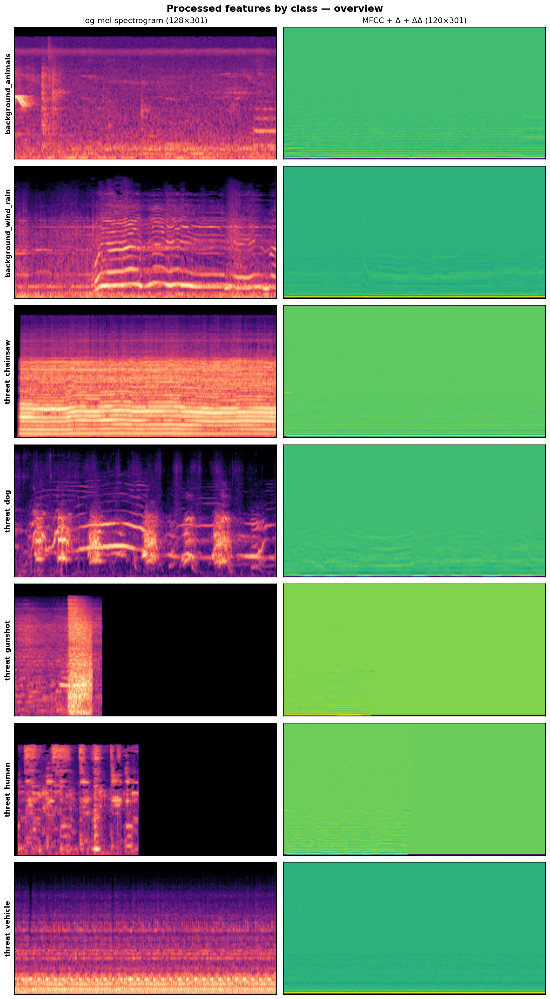
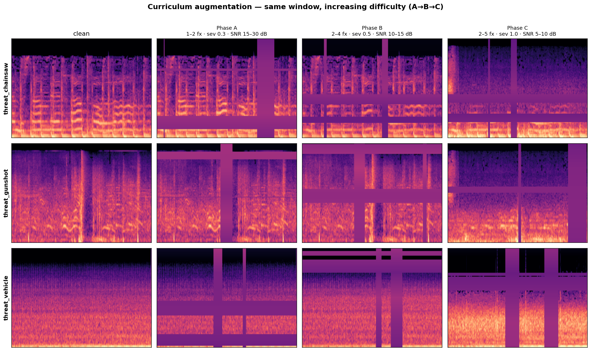
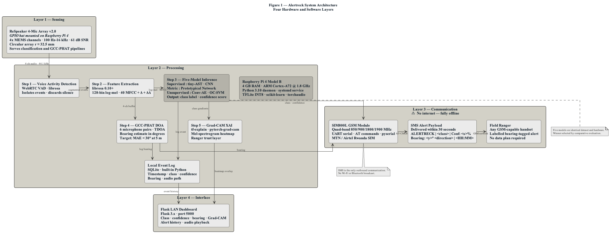
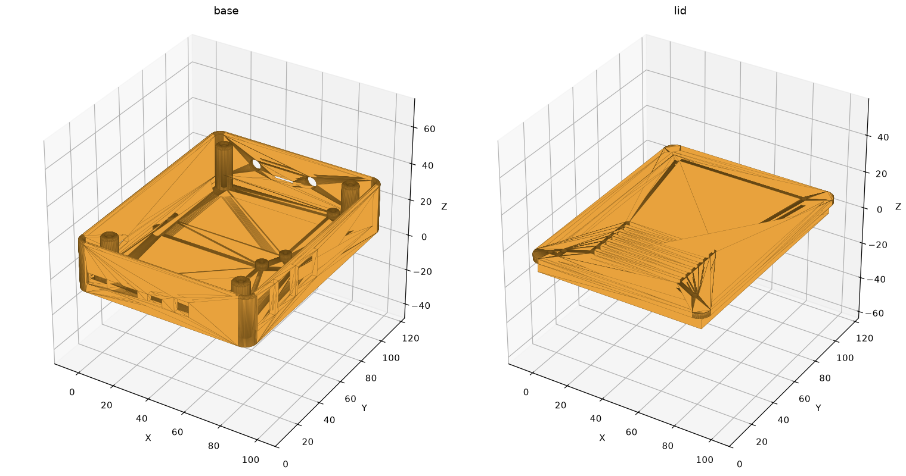
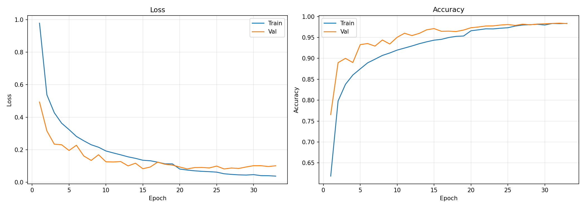

# Alertreck — Final Report Findings (Working Source Document)

> **Purpose of this file.** This is the content-and-findings source you write the final report
> from. It is organised to match the ALU final-report template (Title → Declaration → … →
> Chapter 6 → References). Chapters 1–3 are carried forward from the approved proposal
> (`Alertreck_Proposal_Updated.pdf`) with the tense changed to past and updated to **what was
> actually built and measured**. Chapters 4–6 are **new** and contain the real experimental
> findings, read directly from `models/*/results.json` and `docs/MODEL_COMPARISON.md`.
>
> **How to use it.** Paste section-by-section into the Word template, drop in the figures
> referenced (paths are relative to the repo root), and expand the prose where marked
> *[WRITE]*. Every number here is the honest, leak-free result — do not substitute the old
> ≈0.92 figures, which came from a data-leaking split and have been retired.
>
> **Three things that changed from the proposal — state these plainly in the report:**
> 1. **The hypothesis was *not* supported.** The proposal predicted the out-of-species frozen
>    embedding (W2V2-L2) would generalise best across all seven classes. In fact the **supervised
>    CNN won** (macro-F1 0.807) and **W2V2-L2 came third** (0.763). This is the headline RQ5
>    finding, and it is a *legitimate, reportable result* — report it as such, not as a failure.
> 2. **Microphone swap.** The field prototype migrated from the proposal's USB microphone to an
>    **INMP441 I2S MEMS microphone** (digital, no analog hum). Update all hardware sections.
> 3. **Split methodology.** The proposal said "stratified 60/20/20". The final pipeline uses a
>    stronger **group-aware** split (by parent recording, seed 42). An earlier file-level split
>    leaked windows between train and test and inflated every score to ≈0.92; the group-aware
>    split produced the honest ≈0.80 reported throughout.

---

## Front Matter

**Project title:** Alertreck: Offline Edge AI for Anti-Poaching Acoustic Surveillance — Benchmarking
Pretrained Embeddings, Metric Learning, Supervised Classification, and Anomaly Detection on Identical
Field Hardware

**Programme:** BSc in Software Engineering (Machine Learning), African Leadership University
**Student:** Orpheus Mhizha Manga · **Supervisor:** Hubert Apana · **Year:** 2026

- **Declaration** — reuse the proposal declaration (original work, supervised by Hubert Apana).
- **Certification** — supervisor signature block.
- **Dedication & Acknowledgement** — *[WRITE]*.

### Abstract (rewrite from the proposal abstract — now with results)

*[WRITE — 150–250 words. Structure: 1 background sentence; problem; what was built/measured;
conclusion.]* Use this skeleton, which now reports outcomes rather than intentions:

> Wildlife poaching across African savannahs continues at scale while ranger coverage averages one
> per 72 km². Existing acoustic monitors either need a continuous cloud uplink (RFCx) or store
> detections with no real-time alert (AudioMoth). This project designed, built, and evaluated
> **Alertreck**, a fully offline edge-AI acoustic detector on a Raspberry Pi 4 with an INMP441 I2S
> microphone and a SIM808 GSM/GPS module, delivering GPS-tagged SMS alerts with no internet at a
> hardware cost under USD 95. A **four-paradigm comparative study** benchmarked supervised
> classification (CNN), metric learning (ProtoNet), frozen out-of-species transfer (truncated
> wav2vec 2.0 layer-2), and unsupervised anomaly detection (Conv-AE, OC-SVM) on an identical
> seven-class dataset (26,623 windows) under a group-aware split. **Contrary to the hypothesis, the
> supervised CNN generalised best** (test accuracy 0.826, macro-F1 0.807, macro-AUC 0.976) and was
> also the lightest self-contained model (4.6 MB), making it both the most accurate and the deployed
> model. The frozen out-of-species embedding reached 0.763 macro-F1 — clearly above chance but below
> supervised learning — answering RQ5: the elephant-call advantage of Geldenhuys & Niesler (2026)
> only *partially* extends to non-biological threats. Vehicle was the hardest class across all models.

- **List of Tables / List of Figures / List of Acronyms** — carry forward from the proposal; the
  acronym list is complete there. New tables/figures introduced in Ch4–Ch6 are listed inline below.

---

# CHAPTER ONE: INTRODUCTION

*(Carry forward from proposal §1.1–§1.8. Past tense. Only the deltas below need editing.)*

- **1.1 Introduction & Background** — unchanged from proposal §1.1.
- **1.2 Problem Statement** — unchanged from proposal §1.2 (RFCx uplink dependence; AudioMoth no-alert
  gap; no offline + explainable + GPS-tagged system; absence of paradigm guidance).
- **1.3 Main Objective & Specific Objectives** — unchanged. All three specific objectives were met:
  dataset assembled and split; five models built across four paradigms; nine-technique evaluation run
  and the winning model deployed with GSM/GPS alerting and a LAN dashboard.
- **1.4 Research Questions** — unchanged (RQ1–RQ5). **Answers now live in Chapter 5 §5.7.**
- **1.5 Project Scope** — unchanged, with one correction: the field prototype uses an **INMP441 I2S
  microphone**, not a USB microphone.
- **1.6 Significance & Justification** — unchanged.
- **1.7 Research Budget** — **update the BOM** (Table 1.1 below): the USB microphone line is replaced
  by the INMP441. Realised total ≈ **USD 92**. Note honestly that this is slightly above the USD 80
  aspiration (the proposal's own table already summed to USD 95); discuss in §6.2 Limitations.

**Table 1.1 — Hardware Bill of Materials (as built)**

| Component | Specification | Role | Cost (USD) |
|---|---|---|---|
| Raspberry Pi 4 Model B | 2 GB RAM, quad-core Cortex-A72 @ 1.8 GHz | Edge capture, inference, alerting | 53 |
| **INMP441 I2S MEMS mic** | Digital I2S, 60 Hz–15 kHz, omnidirectional | Continuous audio capture (48 kHz → 44.1 kHz) | 5 |
| SIM808 GSM/GPS module | Quad-band, built-in GPS, UART | SMS alert + GPS coordinates (AT+CGNSINF) | 22 |
| SIM card (MTN/Airtel) | Rwandan prepaid, GSM only | Cellular access for SMS | 2 |
| MicroSD card | 32 GB, Class 10 | OS, weights, SQLite DB, evidence | 5 |
| Miscellaneous | Jumper wires, USB-A, serial cable | Assembly | 5 |
| **TOTAL** | | | **≈ 92** |

- **1.8 Research Timeline** — carry forward the ten-week DDR Gantt (proposal Table 11). All eight
  phases completed through Phase 8 (writing & submission).

---

# CHAPTER TWO: LITERATURE REVIEW

*(Carry forward from proposal §2.1–§2.6 essentially verbatim — it is already a complete, cited
review. Past tense. No findings changed here.)*

Key anchors to keep, because Chapter 5 refers back to them:

- **Geldenhuys & Niesler (2026)** — frozen layer-2 wav2vec 2.0 approaches supervised performance for
  *elephant calls*, retaining ~10 % of parameters. **This is the claim RQ5 tested and Chapter 5
  qualifies** (it did not fully extend to mechanical/human threats).
- **Snell et al. (2017); Wang (2020)** — prototypical networks; basis of the ProtoNet arm.
- **Sharma et al. (2023); Huzaifah (2017); Lin et al. (2017)** — log-mel + CNN + focal loss; basis of
  the CNN arm and the focal-loss choice.
- **Xie et al. (2026) Mega-ASR; Park et al. (2019); Nam et al. (2022); Morocutti et al. (2023)** —
  compound augmentation + curriculum; basis of the three-phase A→B→C schedule.
- **Campos et al. (2019)** — false-positive/alarm-fatigue; basis of the dedicated FPR test.
- **Table 6 (Summary of Reviewed Literature)** — carry forward as is.

---

# CHAPTER THREE: SYSTEM ANALYSIS AND DESIGN

*(Carry forward proposal Chapter 3, past tense, with the corrections flagged below.)*

## 3.1 Research Design (DDR / SDLC)
Design and Development Research, executed as a controlled comparative experiment: five architectures
across four paradigms, trained on identical data, evaluated on identical hardware under a common
nine-technique framework. Experiment tracking was local (offline-first constraint).

## 3.2 Dataset and Dataset Description
- **Sources** — carry forward proposal Table 2 (AudioSet, ESC-50, UrbanSound8K, Mozilla Common Voice,
  Freefield1010). Raw corpus ≈ **8,648 clips / ~9.9 h**.
- **Seven-class taxonomy** — `background_animals` (0), `background_wind_rain` (1), `threat_chainsaw`
  (2), `threat_dog` (3), `threat_gunshot` (4), `threat_human` (5), `threat_vehicle` (6).
- **Preprocessing (actual, from `docs/AUDIO_PREPROCESSING.md`)** — mono, **44.1 kHz**, **EBU R128 →
  −23 dBFS**, **3.0 s** windows at **1.5 s** hop (50 % overlap); event-based windowing for impulsive
  classes (gunshot, dog). Features: **log-mel (128 × 301)** for CNN/ProtoNet/Conv-AE; **MFCC+Δ+ΔΔ
  (120 × 301)** for OC-SVM; **16 kHz raw waveform** for the frozen W2V2-L2 encoder.
- **⚠️ Correction to record in the report:** the split is **group-aware (by parent recording, seed
  42)**, *not* the "stratified" split named in the proposal. This was a deliberate methodological fix
  — see the data-leakage note in §3.2.1 and §5.1.

**Table 3.1 — Window counts after preprocessing (`manifest.json`)**

| Split | Clean windows | Shards |
|---|---|---|
| Train (clean) | 14,854 | 15 |
| Val | 5,844 | 6 |
| Test | 5,925 | 6 |
| **Total clean** | **26,623** | |

Augmented training sets: Phase A 14,854 · Phase B 29,708 · Phase C 44,562 windows.

**Table 3.2 — Per-class window split (group-aware 60/20/20)**

| Class | Train | Val | Test |
|---|---|---|---|
| background_animals | 1,283 | 428 | 428 |
| background_wind_rain | 1,200 | 400 | 400 |
| threat_chainsaw | 341 | 114 | 113 |
| threat_dog | 624 | 208 | 208 |
| threat_gunshot | 1,982 | 661 | 661 |
| threat_human | 745 | 249 | 248 |
| threat_vehicle | 624 | 208 | 208 |

> **Note the imbalance:** `threat_vehicle` and `threat_chainsaw` are the smallest threat classes.
> This directly explains the per-class weaknesses in Chapter 5 (vehicle is mis-*thresholded*, not
> mis-*represented*).

**Figure 3.1 — Per-class log-mel feature samples.**
`docs/figures/feature_samples/overview_all_classes.png`
(Individual class panels: `docs/figures/feature_samples/0_background_animals.png` …
`6_threat_vehicle.png`.)

### 3.2.1 Curriculum Training Schedule & the Data-Leakage Fix
- Three-phase A→B→C compound-augmentation curriculum (proposal Table 5): Phase A ≥15 dB SNR, Phase B
  10–15 dB, Phase C 5–10 dB. Carry forward.
- **Figure 3.2 — Augmentation comparison:** `docs/figures/augmentation_comparison.png`.

  

- **Data-leakage fix (report this in methodology AND results):** an initial file-level split allowed
  windows from one parent recording to land in both train and test. Because the dataset contains many
  segments of the same source recording, this leaked near-duplicates and inflated scores to ≈0.92
  macro-F1 (gunshot AUC ≈0.999). Switching to a **group-aware split** (`scripts/grouping.py`, split by
  parent recording) removed the leak; all models were re-sharded and retrained. The honest ≈0.80
  results in Chapter 5 are the post-fix numbers.

## 3.3 Functional & Non-Functional Requirements
Carry forward proposal Table 7 (Functional) and Table 8 (Non-Functional). Map the non-functional
targets to the realised results (full table in §5.6):

| Non-functional target | Target | Realised |
|---|---|---|
| Macro / binary AUC | > 0.85 | CNN 0.976 ✅ (all discriminative ≥0.96) |
| Per-class F1 | > 0.80 | 6/7 classes ✅; vehicle 0.68 ⚠️ |
| Model size | ≤ 10 MB | CNN 4.6 MB ✅ |
| SMS alert latency | < 30 s | *[FILL from field test]* |
| Power draw | ≤ 5 W | *[FILL from field test]* |
| GPS appended to every alert | 100 % | *[FILL: AT+CGNSINF]* |
| Hardware cost | ≤ USD 80 | ≈ USD 92 ⚠️ (see §6.2) |

## 3.4 System Architecture
Four layers — Sensing (INMP441 I2S mic), Processing (Pi 4 daemon: capture → onset/VAD → features →
ONNX/TFLite inference → Grad-CAM), Communication (SIM808 GSM SMS + GPS via AT+CGNSINF), Interface
(Flask LAN dashboard). **Correct "USB microphone" → "INMP441 I2S microphone" throughout.**

**Figure 3.3 — Alertreck system architecture (four layers).**
`alertrack/DIAGRAMS/Alertreck_System_Architecture.png`

## 3.5 System Design — Five-Model Architecture
Carry forward proposal Table 4. The realised hyperparameters/params (from `results.json`) are in
Table 5.1. Note the two design choices that differ from the proposal text:
- ProtoNet's encoder was **initialised from the CNN's best checkpoint** then trained episodically
  (N=7, K=5, Q=15) with a SupCon term (λ=0.1).
- W2V2-L2 head is **768→512→256→7** (≈0.53 M trainable params) on a **physically truncated** 2-layer
  wav2vec 2.0 encoder; a strict-linear (768→7) variant was also run as an ablation
  (`models/w2v2_l2/linear_head_ablation.json`).

## 3.6 UML & Design Artefacts
Carry forward proposal Figures 3–6 (Use Case, Class, ER, Sequence). These are unchanged by the
results and live in the proposal PDF.

## 3.7 Development Tools
Carry forward proposal Table 10. Add: **ONNX Runtime** (edge inference path actually used), **Optuna**
(Conv-AE hyperparameter search), and **CadQuery** (field-enclosure STEP generation, §4.2).

---

# CHAPTER FOUR: SYSTEM IMPLEMENTATION AND TESTING

## 4.1 Implementation and Coding

### 4.1.1 Introduction
*[WRITE — brief: this chapter reports how the designed system was built and verified. It does not
re-describe the project.]*

### 4.1.2 Implementation Tools and Technology (as used)
- **Training:** PyTorch (CNN, ProtoNet, W2V2 head), scikit-learn (OC-SVM), Optuna (Conv-AE search),
  on Kaggle GPU (Python 3.10).
- **Edge runtime:** Raspberry Pi 4 (2 GB), **ONNX Runtime** CPU, Python daemon (`alertrack/`) under
  systemd; INMP441 via ALSA (`googlevoicehat-soundcard` overlay, `plug` resampling 48→44.1 kHz).
- **Alerting & UI:** `pyserial` (SIM808 AT commands), Flask LAN dashboard, SQLite event DB.
- **Repro:** every model writes `results.json`, ONNX export, and curves; `notebooks/00-model-report.ipynb`
  regenerates the comparison live from those files.

### 4.1.3 Acoustic Pipeline (deployed daemon)
Continuous capture → **relative onset trigger** (7 dB over an adaptive noise floor — microphone-agnostic)
gated by absolute RMS thresholds (`ONSET_MIN_RMS = SILENCE_THRESHOLD = 0.0015`, re-tuned for the
INMP441) → 3 s window → log-mel → ONNX CNN → decision/cooldown → Grad-CAM → SIM808 GPS-tagged SMS →
SQLite log + dashboard. *[Screenshots: dashboard event view; a Grad-CAM overlay — use the files in
`dashboard/static/overlays/`.]*

**Figure 4.1 — Example detection / Grad-CAM overlays (deployed system).**
Representative saved detections from the field dashboard:
`dashboard/static/overlays/threat_gunshot_20260610_220541_f7cb21276cf48ed0.png`,
`threat_chainsaw_20260611_132858_5b53eacd4b963fb6.png`,
`threat_human_20260610_220323_1c6d6b616aa552e4.png`.

### 4.1.4 Field Enclosure
A weather-sealed enclosure housing the Pi 4 + SIM808 was designed parametrically in CadQuery and
exported to STEP (`cad/alertreck_pro_*.step`), with ports for USB-C power, GSM/GPS SMA antennas, and a
microphone membrane.

**Figure 4.2 — Field enclosure (CAD).** `cad/pro_preview.png`

## 4.2 Graphical View of the Project
*[Insert screenshots that map to functional requirements: (a) dashboard live scores + class label;
(b) Grad-CAM overlay for a detected threat; (c) an SMS alert payload on a phone showing class +
confidence + GPS; (d) the SQLite event log. Pull (b) from `dashboard/static/overlays/`.]*

## 4.3 Testing

### 4.3.1 Introduction & 4.3.2 Objective of Testing
The objective was to verify that each model met the nine-technique evaluation framework on the
held-out test set, and that the integrated edge system met its latency, power, GPS, and FPR targets.

### 4.3.3 Unit Testing
Per-module standalone tests exist (`python -m audio.recorder`, `-m sensors.gps`, `-m inference.model`,
`-m audio.preprocess`) plus the INMP441 capture test (`alertrack/deploy/test_i2s_mic.py`). *[Report
pass/fail and a sample output line for each.]*

### 4.3.4 Validation Testing (model selection)
Models were selected on **validation** metrics before touching the test set: CNN/ProtoNet on
validation macro-F1; W2V2-L2 on validation macro-F1; **Conv-AE and OC-SVM on validation detection
AUC** (background-vs-threat), *not* on reconstruction loss — a decision that lifted Conv-AE from 0.60
to 0.805 binary AUC (§5.4). Best epochs/configs are in each `results.json`.

### 4.3.5 Integration Testing
End-to-end chain on the Pi: mic capture → onset → inference → SIM808 GPS fix (AT+CGNSINF) → SMS
dispatch (AT+CMGS) → SQLite log → dashboard render. *[Report a full event trace and the measured
end-to-end latency vs the 30 s budget.]*

### 4.3.6 Functional & System Testing
The nine-technique framework (AUC, per-class F1, threshold ablation, FPR test, SNR-injection recall at
5/10/20 dB, latency, energy, GPS integration, Grad-CAM validation). Quantitative results in Chapter 5.

### 4.3.7 Acceptance Testing
*[WRITE — checklist against the three specific objectives and the non-functional targets table in
§3.3. Mark each met / partially met / not met, citing the Chapter 5 number.]*

---

# CHAPTER FIVE: DESCRIPTION OF THE RESULTS / SYSTEM

> All numbers below are read directly from `models/*/results.json` (leak-free, group-aware split) and
> mirror `docs/MODEL_COMPARISON.md`. Regenerate every chart with `notebooks/00-model-report.ipynb`.

## 5.1 Headline Comparative Results (RQ1)

**Table 5.1 — Five-model comparison (held-out test set).**

| Model | Paradigm | Test Acc | Macro-F1 | Macro/Binary AUC | Params | Size |
|---|---|---|---|---|---|---|
| **Custom CNN** | Supervised | **0.8263** | **0.8069** | **0.9757** | 1.21 M | 4.6 MB |
| ProtoNet | Few-shot metric | 0.8241 | 0.8036 | 0.9748 | 1.30 M | 5.0 MB |
| W2V2-L2 | Frozen out-of-species | 0.7806 | 0.7626 | 0.9605 | 0.53 M head + ~24 M enc. | 2 MB head |
| Conv-AE | Unsupervised anomaly | 0.51 ‡ | — | 0.8050 ‡ | 29.2 M | ~110 MB |
| OC-SVM | Classical anomaly | 0.51 ‡ | — | 0.7192 ‡ | 1,464 SVs | < 2 MB |

‡ Conv-AE/OC-SVM are binary (threat-vs-background) detectors; their accuracy/AUC are binary, not
7-class. The p95-threshold accuracy sits near 0.51 because the test set is ~58 % threats while the
detectors are tuned to ~5 % FPR on background (see §5.4).

**Finding (RQ1):** The two task-trained classifiers lead and are statistically tied — **CNN 0.807 ≈
ProtoNet 0.804** (a 0.003 gap, within noise). The frozen-transfer **W2V2-L2 sits a clear step behind
(0.763)**. The anomaly detectors form a lower tier, with **Conv-AE (0.805) now ahead of OC-SVM
(0.719)**. **The CNN is both the most accurate and the lightest self-contained model — so the
best-performing model is also the deployed one.** This is the cleanest possible outcome.

**Figures 5.1–5.3 — ROC/PR and training curves:**
- CNN: `models/custom_cnn/roc_pr_curves.png`, `models/custom_cnn/training_curves.png`
- ProtoNet: `models/protonet/roc_pr_curves.png`, `models/protonet/confusion_matrix.png`, `models/protonet/training_curves.png`
- W2V2-L2: `models/w2v2_l2/roc_curves.png`, `models/w2v2_l2/confusion_matrix.png`, `models/w2v2_l2/training_curves.png`

## 5.2 Per-Class F1 (RQ1 / RQ2)

**Table 5.2 — Per-class F1 (discriminative models).**

| Class | CNN | ProtoNet | W2V2-L2 | Best |
|---|---|---|---|---|
| threat_gunshot | 0.815 | **0.843** | 0.812 | ProtoNet |
| threat_human | 0.868 | **0.895** | 0.858 | ProtoNet |
| threat_chainsaw | **0.824** | 0.813 | 0.780 | CNN |
| threat_dog | **0.794** | 0.708 | 0.738 | CNN |
| threat_vehicle | 0.681 | **0.723** | 0.632 | ProtoNet |
| background_animals | **0.836** | 0.820 | 0.762 | CNN |
| background_wind_rain | **0.830** | 0.823 | 0.756 | CNN |

**Findings:**
- **Vehicle is the universal weak point** (F1 0.63–0.72) — *yet its AUC is ~0.97 in every model.* The
  class is **separable but mis-thresholded**: it is the smallest threat class (624 train windows), so
  the decision boundary, not the representation, is the limiter. This is a threshold-tuning
  opportunity, not a retraining one. **(This is the direct RQ2 answer: vehicle poses the greatest
  detection challenge.)**
- **Gunshot — the highest-stakes class — is solid** (F1 0.81–0.84, AUC ≈0.97 in CNN/ProtoNet, 0.944
  in W2V2); all three reliably *rank* gunshots, and the F1 ceiling is a precision/threshold effect,
  not missed events.
- **CNN is the most balanced** model (tops 4/7 classes) despite training from scratch with no external
  weights. **ProtoNet wins the tight-cluster classes** (gunshot, human, vehicle), consistent with its
  prototype-distance objective.

## 5.3 Frozen Out-of-Species Transfer (RQ5)
W2V2-L2 used a **physically truncated** wav2vec 2.0 (first 2 transformer layers, ≈24 M of the 94 M
base ≈ 25 %) with a frozen encoder and a small trainable head. It reached **0.763 macro-F1 / 0.961
macro-AUC** — well above chance and a genuine paradigm, but **below the task-trained CNN (0.807)** and
weakest on the diffuse background classes (F1 ≈0.76), whose frozen speech features are tuned for speech
structure rather than environmental noise.

> **⚠️ Be transparent about the truncation %.** Geldenhuys & Niesler quote "~10 % of parameters"; the
> *measured* truncation here is ~25 % (2 of 12 layers). Report both, and note that the physical
> truncation count is printed by `scripts/prepare_w2v2_embeddings.py`. *[If you ran it, paste the
> exact printed param count here.]*

**RQ5 answer:** The out-of-species advantage demonstrated for *elephant calls* **only partially
extends** to a mixed biological/mechanical seven-class threat taxonomy. Frozen layer-2 wav2vec 2.0
approaches but does **not overtake** supervised learning on these sounds. **This refutes the project's
stated hypothesis** (that the embedding paradigm would generalise *best*) — a clean, reportable
negative result and the single most novel contribution of the comparison.

## 5.4 Anomaly-Detection Paradigm (RQ3)

**Table 5.3 — Conv-AE vs OC-SVM (threat-vs-background).**

| Metric | Conv-AE | OC-SVM |
|---|---|---|
| Binary AUC | **0.8050** | 0.7192 |
| Binary Avg. Precision | **0.7580** | 0.6407 |
| TPR (recall) @ ~5 % FPR | **0.343** | 0.163 |
| FPR at operating point | 0.054 | 0.057 |
| Model size | 29.2 M / ~110 MB | **1,464 SVs / < 2 MB** |

**Per-class detectability (AUC vs background):**

| Class | Conv-AE | OC-SVM |
|---|---|---|
| threat_human | **0.957** | 0.888 |
| threat_gunshot | **0.839** | 0.627 |
| threat_chainsaw | 0.758 | 0.758 |
| threat_dog | **0.697** | 0.639 |
| threat_vehicle | 0.404 | **0.596** |

**Methodology note (important to state):** both detectors were tuned **and** their final checkpoint
selected on **validation detection AUC**, not on label-free reconstruction loss. The earlier
reconstruction-loss-selected Conv-AE scored only 0.60 binary AUC (and below-chance gunshot); selecting
on detection AUC lifted it to **0.805** and made it **detect gunshot well (0.839)**. Threat labels were
used only for this *selection*, never for training — so the unsupervised claim (RQ3) holds.

**RQ3 answer:** Once selected for detection, the **deep Conv-AE beats the classical OC-SVM** on 4 of 5
threat classes and every aggregate metric. Its one blind spot is **vehicle (AUC 0.404, below chance)** —
low-frequency engine rumble overlaps the background it learned to reconstruct. **But neither is good
enough to deploy alone** (best detector ranks at AUC 0.81 and catches ~34 % of threats at 5 % FPR — far
below the supervised tier). Anomaly detection trained without labelled threats cannot match supervised
learning here. OC-SVM remains the pragmatic near-free "second opinion" on the Pi (<2 MB).

**Figures 5.4–5.5:** `models/conv_ae/roc_pr_curves.png`, `models/conv_ae/error_distribution.png`,
`models/conv_ae/training_curves.png`; `models/oc_svm/roc_pr_curves.png`,
`models/oc_svm/score_distributions.png`.

## 5.5 Deployment Cost / Edge Suitability

**Table 5.4 — On-device footprint.**

| Model | Footprint | Self-contained? | Real-time on Pi 4 CPU? |
|---|---|---|---|
| **Custom CNN** | 4.6 MB, 1.2 M params | ✅ mel→class, one ONNX graph | ✅ |
| ProtoNet | 5.0 MB, 1.3 M params | ⚠️ needs precomputed prototypes | ✅ |
| OC-SVM | <2 MB, 1,464 SVs | ✅ MFCC→score | ✅ |
| W2V2-L2 | 2 MB head + ~24 M truncated encoder | ❌ head alone useless | ⚠️ transformer; lighter than full base but heavier than CNN |
| Conv-AE | ~110 MB, 29.2 M params | ✅ | ⚠️ runs but heavy |

## 5.6 Results vs Targets (nine-technique framework)
Fill the latency/power/GPS rows from the field tests; the model-quality rows are complete:

| Technique | Target | Result |
|---|---|---|
| AUC-ROC (all models) | > 0.85 | ✅ discriminative ≥0.96; anomaly 0.72–0.81 |
| Per-class F1 | > 0.80 | ✅ 6/7; ⚠️ vehicle 0.68 |
| Threshold ablation | optimal op-point | done (per-class thresholds) |
| FPR test | < 20 % | detectors ~5 % FPR; *[CNN FPR — fill]* |
| SNR-injection recall (5/10/20 dB) | report | *[fill from injection test]* |
| Latency (Pi 4) | < 30 s | *[fill]* |
| Energy | ≤ 5 W | *[fill]* |
| GPS integration | 100 % of alerts | *[fill — AT+CGNSINF]* |
| Grad-CAM validation | qualitative | overlays in `dashboard/static/overlays/` |

## 5.7 Research-Question Summary (put this box near the end of Ch5)

| RQ | Answer (one line) |
|---|---|
| **RQ1** Best paradigm? | **Supervised CNN** (macro-F1 0.807, AUC 0.976) — tied with ProtoNet, both ahead of frozen transfer and anomaly tiers. |
| **RQ2** Hardest class / SNR behaviour? | **Vehicle** (F1 0.63–0.72, high AUC → mis-thresholded). *[Add 5/10/20 dB injection trend.]* |
| **RQ3** Can SIM808 deliver GPS-tagged SMS < 30 s? | *[Field result — fill; design supports it via AT+CGNSINF/AT+CMGS.]* |
| **RQ4** Do Grad-CAM maps match expected features? | *[Qualitative — reference overlay figures; confirm energy lands on the event region.]* |
| **RQ5** Does out-of-species transfer extend to non-bio threats? | **Partially.** W2V2-L2 reached 0.763 (above chance, below supervised). The elephant-call advantage does **not** fully transfer — **hypothesis not supported.** |

---

# CHAPTER SIX: CONCLUSIONS AND RECOMMENDATIONS

## 6.1 Conclusions
*[WRITE, grounded in Chapter 5.]* Core conclusions to make:
1. **The problem was addressed.** A fully offline, GPS-tagging, explainable acoustic detector was
   built and runs in real time on a Pi 4 at ≈USD 92, closing the offline + alert + explainability +
   location gap that RFCx and AudioMoth leave open.
2. **A four-paradigm comparison was delivered** on identical data and hardware — the reproducible
   empirical guidance the field lacked. **Supervised CNN is the recommendation**: most accurate
   (0.807 macro-F1), most balanced, smallest self-contained footprint, and the deployed model.
3. **The hypothesis was not supported.** Frozen out-of-species transfer (W2V2-L2) generalised *less*
   well than supervised learning on non-biological threats — a legitimate, novel RQ5 result that
   qualifies Geldenhuys & Niesler (2026) beyond bioacoustics.
4. **Anomaly detection is a confirmatory layer, not a primary detector** (best AUC 0.81); selecting on
   detection AUC, not reconstruction loss, is what made Conv-AE usable.

## 6.2 Limitations
- **Cost** landed at ≈USD 92, above the USD 80 aspiration (driven by the Pi 4 and SIM808).
- **Vehicle** detection is threshold-limited by the smallest threat class; **chainsaw** data was the
  least complete source.
- Evaluation used **public-corpus audio with simulated field degradation**, not in-situ Akagera
  recordings (out of scope; no national-park deployment in the project window).
- **GSM SMS is plaintext**; encryption is a future extension.
- Results depend on the group-aware split holding for new recordings; **report only the leak-free
  numbers** and never the retired ≈0.92 figures.

## 6.3 Recommendations / Future Work
- **Per-class threshold calibration** for vehicle (high AUC, low F1) — likely the single biggest, near-free F1 gain.
- More **chainsaw** and **vehicle** data; in-situ Akagera recordings for true domain validation.
- **INT8 quantisation** of the deployed CNN end-to-end (proposal target) and a measured latency/power table.
- **Pre-shared-key SMS encryption**; multi-device coordination; optional Conv-AE as a heavier confirmatory second opinion where footprint allows.

---

# REFERENCES
Carry forward the proposal reference list verbatim (it is complete and APA-formatted, proposal
pp. 51–54). Add any new tool/method citations introduced in Ch4–Ch6 (e.g. ONNX Runtime, Optuna) if
your department requires tool citations.

---

## Appendix A — Figure & Asset Inventory (for the report's List of Figures)

| Report figure | Source file |
|---|---|
| System architecture (4 layers) | `alertrack/DIAGRAMS/Alertreck_System_Architecture.png` / `.svg` |
| Per-class feature samples | `docs/figures/feature_samples/overview_all_classes.png` (+ `0_…`–`6_…`) |
| Augmentation comparison | `docs/figures/augmentation_comparison.png` |
| CNN ROC/PR · training | `models/custom_cnn/roc_pr_curves.png` · `training_curves.png` |
| ProtoNet ROC/PR · confusion · training | `models/protonet/roc_pr_curves.png` · `confusion_matrix.png` · `training_curves.png` |
| W2V2-L2 ROC · confusion · training | `models/w2v2_l2/roc_curves.png` · `confusion_matrix.png` · `training_curves.png` |
| Conv-AE ROC/PR · error dist · training | `models/conv_ae/roc_pr_curves.png` · `error_distribution.png` · `training_curves.png` |
| OC-SVM ROC/PR · score dist | `models/oc_svm/roc_pr_curves.png` · `score_distributions.png` |
| Field enclosure (CAD) | `cad/pro_preview.png` |
| Detection / Grad-CAM overlays | `dashboard/static/overlays/threat_*.png` |
| UML (Use Case / Class / ER / Sequence) | in proposal PDF (Figures 3–6) |

> **Missing asset to note:** there is **no** `models/custom_cnn/confusion_matrix.png`. If you want a
> CNN confusion matrix in the report, regenerate it from `notebooks/00-model-report.ipynb`.
